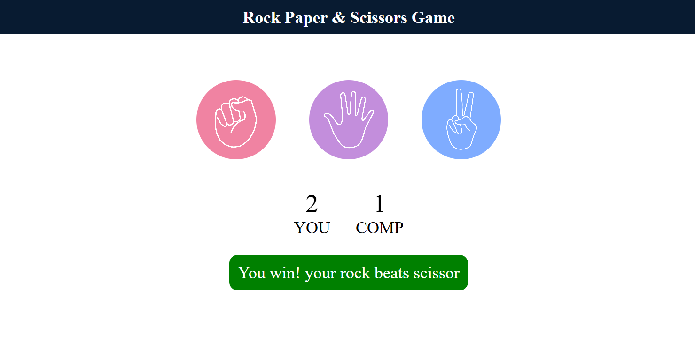

#  Stone‑Paper‑Scissor Game

A classic **Stone‑Paper‑Scissor** game implemented for fun and learning. Users can play against the computer in a simple and interactive setup.

---

##  Features

-  Play Rock, Paper, Scissors against the computer
-  Random computer choice ensures unpredictability
-  Easy-to-use UI on Browser
-  Great starter project for learning control flow and input handling

---

##  Tech Stack

-  Language: **JavaScript**
-  Random module or equivalent for computer move generation
-  Ibasic UI using **HTML/CSS**

---
###  UI Screenshot

